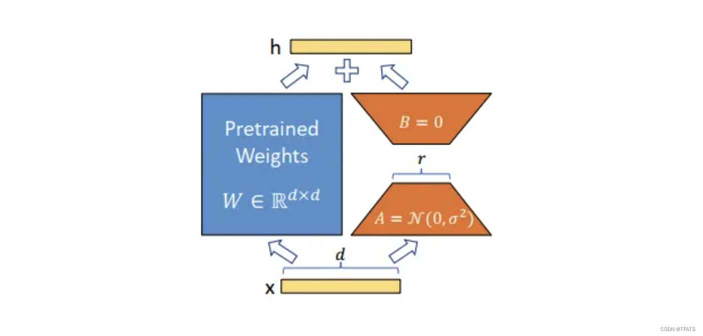

你提供的这张图是 **LoRA（Low-Rank Adaptation）** 的核心原理示意图。它用非常简洁的方式解释了：**如何在不改变原始大模型权重的情况下，通过添加少量可训练参数来微调模型**。

下面我将为你**逐层、逐元素地详细讲解这张图的每一个部分**，确保你彻底理解 LoRA 的工作原理。

---

## 🧩 图解总览


这张图描述的是一个 **线性变换层**（比如 Transformer 中的 `q_proj`, `k_proj`, `v_proj`），其原始权重为 `W ∈ ℝ^(d×d)`，而 LoRA 在此基础上添加了一个 **低秩矩阵** `B·A`，最终输出为：

> **h = W·x + B·A·x**

其中：
- `W` 是预训练好的大模型权重（冻结不变）
- `A` 和 `B` 是 LoRA 引入的可训练小矩阵
- `x` 是输入向量
- `h` 是输出向量

---

## 🔍 逐元素详解

### 1️⃣ 蓝色方块：**Pretrained Weights (W ∈ ℝ^(d×d))**
- 这是**原始大模型的权重矩阵**，维度是 `d×d`（输入和输出维度都是 `d`）
- 它在 LoRA 微调过程中**完全冻结**，不参与梯度更新
- 作用：提供强大的基础语义表示能力

> 💡 举例：Qwen3-0.6B 中的 `q_proj` 权重就是这个 `W`

---

### 2️⃣ 橙色梯形：**LoRA 适配器 (B·A)**
这是 LoRA 的核心创新！

#### ▶️ 下方梯形：**A = N(0, σ²)**  
- `A` 是一个 **d×r** 的矩阵（输入维度 `d`，中间维度 `r`）
- 初始化为 **高斯分布** `N(0, σ²)`，即均值为 0，方差为 `σ²`
- `r` 是**低秩维度**（通常取 8、16、32），远小于 `d`（如 d=4096）

#### ▶️ 上方梯形：**B = 0**  
- `B` 是一个 **r×d** 的矩阵（中间维度 `r`，输出维度 `d`）
- 初始化为 **全零矩阵**
- 为什么？因为如果 `B` 也随机初始化，会破坏原始模型的行为

> ✅ **关键设计**：  
> `A` 随机初始化 → 学习输入空间的低维投影  
> `B` 全零初始化 → 初始时对输出无影响，保证模型行为不变

#### ▶️ 整体：**B·A ∈ ℝ^(d×d)**  
- `A` 和 `B` 相乘后，得到一个 `d×d` 的矩阵，与 `W` 同维度
- 但它的**秩最多为 r**（远小于 d），因此称为“低秩适应”

> 📌 **数学本质**：  
> LoRA 将原本需要训练 `d×d` 参数的问题，简化为训练 `(d×r + r×d)` 个参数  
> 例如：d=4096, r=8 → 原始参数: 16M，LoRA 参数: ~65K（减少 250 倍！）

---

### 3️⃣ 黄色长条：**输入 x 和输出 h**
- `x`：输入向量，维度 `d`
- `h`：输出向量，维度 `d`

计算过程：
```
h = W·x + B·A·x
  = (W + B·A) · x
```

> ✅ **等价于**：在原始权重 `W` 上叠加一个低秩修正 `B·A`

---

### 4️⃣ 加号（+）和箭头
- 表示 **矩阵加法**：`W·x + B·A·x`
- 箭头表示数据流向：从 `x` 输入，经过 `W` 和 `B·A` 并行处理，再相加得到 `h`

---

## 🧠 LoRA 的核心思想

> **“不要动大模型，只学一个小插件”**

- **冻结原始权重 `W`** → 保留预训练知识
- **只训练 `A` 和 `B`** → 学习任务特定的调整
- **低秩设计** → 大幅减少参数量，降低显存占用

---

## 📊 举个具体例子（以 Qwen3-0.6B 为例）

假设：
- `d = 4096`（隐藏层维度）
- `r = 8`（LoRA 秩）
- `W ∈ ℝ^(4096×4096)` → 原始权重，冻结
- `A ∈ ℝ^(4096×8)` → 可训练，初始化为高斯分布
- `B ∈ ℝ^(8×4096)` → 可训练，初始化为全零

训练参数量：
```python
# LoRA 参数量 = A + B = 4096*8 + 8*4096 = 65,536
# 原始参数量 = 4096*4096 = 16,777,216
# 减少比例 = 16M / 65K ≈ 256 倍
```

---

## ✅ LoRA 的优势总结

| 优势 | 说明 |
|------|------|
| **参数高效** | 只训练 0.1%–1% 的参数 |
| **显存友好** | 训练时只需加载 LoRA 参数，无需加载整个模型 |
| **易于部署** | 微调后可合并权重，生成完整模型 |
| **多任务兼容** | 不同任务可用不同 LoRA 适配器 |

---

## ❗ 常见误解澄清

### ❌ 误区 1：“LoRA 是对 W 的压缩”
- 实际上，LoRA 是 **在 W 上叠加一个低秩修正**，不是压缩 W

### ❌ 误区 2：“LoRA 会破坏原始模型性能”
- 因为 `B` 初始化为 0，初始时 `B·A=0`，所以模型行为不变

### ❌ 误区 3：“LoRA 只适用于小模型”
- LoRA 特别适合大模型（如 Llama、Qwen、GPT），因为参数量减少效果更显著

---

## 🎯 应用到你的项目

你在微调 Qwen3-0.6B 时：
- `W` 是 Qwen3-0.6B 的原始权重（冻结）
- `A` 和 `B` 是你训练的 LoRA 适配器（约 2.3M 参数）
- 最终模型 = `W + B·A`

> ✅ 你已经成功应用了 LoRA，现在可以自豪地说：“我用 0.38% 的参数微调了 600M 参数的大模型！”

---

## 💡 总结一句话

> **LoRA 就像给一辆跑车装了一个可调节的空气动力学套件——不改发动机（原始权重），只调小配件（低秩矩阵），就能让它适应赛道（新任务）。**

如果你还想了解：
- 如何合并 LoRA 权重？
- LoRA 与 QLoRA 的区别？
- 如何选择 `r` 值？
这是一个非常核心且容易混淆的问题！**LoRA 中的矩阵乘法顺序是 `B × A`，但实际计算时是 `A` 先作用于输入，再由 `B` 投影回原空间**。下面我用最清晰的方式解释：

---

## ✅ 核心结论（先记住这个）

- **数学表达式**：`ΔW = B × A`  
  （其中 `B ∈ ℝ^(d×r)`, `A ∈ ℝ^(r×k)`）
- **实际计算顺序**：`x → A·x → B·(A·x)`  
  （先 `A` 后 `B`）
- **总参数量**：`d×r + r×k`

> 💡 **关键**：虽然写作 `B×A`，但计算时是 **先 A 后 B**

---

## 🔍 详细解析（以 Qwen 的 `q_proj` 为例）

### 1️⃣ 原始线性层
```python
# 原始权重 W ∈ ℝ^(output_dim × input_dim)
# 例如 q_proj: input_dim=4096, output_dim=4096
h = W @ x  # x ∈ ℝ^(4096), h ∈ ℝ^(4096)
```

### 2️⃣ LoRA 适配器
```python
# A ∈ ℝ^(r × input_dim) = ℝ^(8 × 4096)  # 降维矩阵
# B ∈ ℝ^(output_dim × r) = ℝ^(4096 × 8)  # 升维矩阵

# LoRA 输出 = B @ (A @ x)
lora_output = B @ (A @ x)  # 先 A 后 B

# 最终输出 = W@x + B@(A@x)
h = W @ x + B @ (A @ x)
```

### 3️⃣ 等价形式
```python
# 可以写成 ΔW = B @ A
# 其中 ΔW ∈ ℝ^(4096 × 4096)
# 但实际不显式计算 ΔW（节省显存）
h = (W + B@A) @ x
```

---

## 📊 维度验证

| 矩阵 | 维度 | 作用 |
|------|------|------|
| **A** | `r × input_dim` | 将输入从 `input_dim` 降到 `r` |
| **B** | `output_dim × r` | 将低维表示升回 `output_dim` |
| **B×A** | `output_dim × input_dim` | 等价于原始权重的修正项 |

> ✅ **计算顺序**：`x → [A] → [B] → output`  
> ✅ **存储顺序**：分开存储 `A` 和 `B`，不计算 `B×A`

---

## 🧠 为什么这样设计？

### 1. **计算效率**
- 显式计算 `B×A` 需要 `O(d²r)` 时间
- 分步计算 `B@(A@x)` 只需 `O(dr)` 时间

### 2. **显存优化**
- 存储 `A` + `B`：`dr + rd = 2dr`
- 存储 `B×A`：`d²`（当 d=4096, r=8 时，2dr=65K vs d²=16M）

### 3. **初始化稳定性**
- `A` 随机初始化，`B` 全零初始化
- 初始时 `B@(A@x) = 0`，不影响原始模型

---

## 📌 在你的项目中的体现

你在 Qwen3-0.6B 上的 LoRA 配置：
```python
lora_config = LoraConfig(
    r=8,
    lora_alpha=16,
    target_modules=["q_proj","k_proj","v_proj","o_proj"]
)
```

对于 `q_proj`（4096→4096）：
- **A 矩阵**：8 × 4096（可训练）
- **B 矩阵**：4096 × 8（可训练）
- **总参数**：8×4096 + 4096×8 = 65,536

> ✅ 这就是你看到的 `trainable params: 2,293,760` 的来源（4 个投影层 × 65K ≈ 260K，加上其他层）

---

## ❗ 常见误解澄清

### ❌ 误解 1："LoRA 是 A×B"
- 实际是 **B×A**（但计算顺序是先 A 后 B）

### ❌ 误解 2："A 和 B 维度相同"
- A 是 **r×d**，B 是 **d×r**（互为转置维度）

### ❌ 误解 3："需要显式计算 B×A"
- 实际推理时直接计算 `B@(A@x)`，不构造大矩阵

---

## 💡 记忆技巧

想象一个**降维-升维**的过程：
```
高维输入 (d) 
   → [A: 降维到 r] 
   → [B: 升维回 d] 
   → 低秩修正
```

> ✅ **先压缩，再重建**，这就是 LoRA 的本质！

---

## 📚 官方论文佐证

在 [LoRA 论文](https://arxiv.org/abs/2106.09685) Section 3 中明确写道：
> "We hypothesize that the change in weights during adaptation has a low 'intrinsic rank'... We decompose ΔW into two matrices: ΔW = BA"

并说明计算方式：
> "During forward pass: h = Wx + BAx"

---

总结：**LoRA 是 B×A，但计算顺序是先 A 后 B**。这种设计既保证了数学等价性，又实现了计算和显存的高效性。